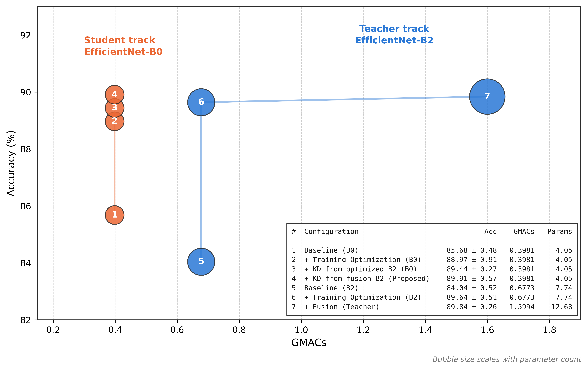
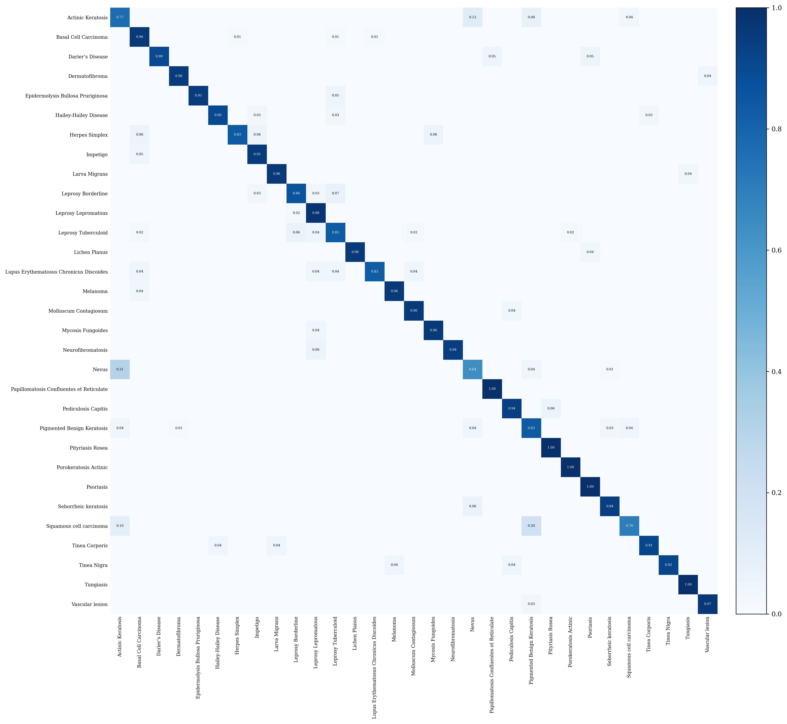
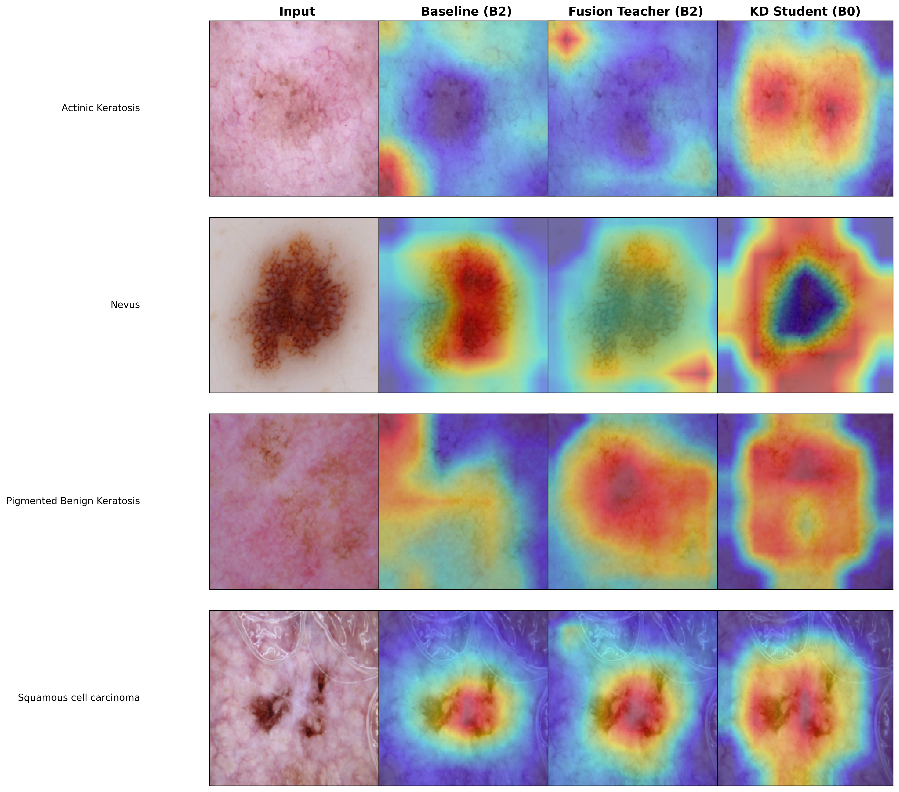
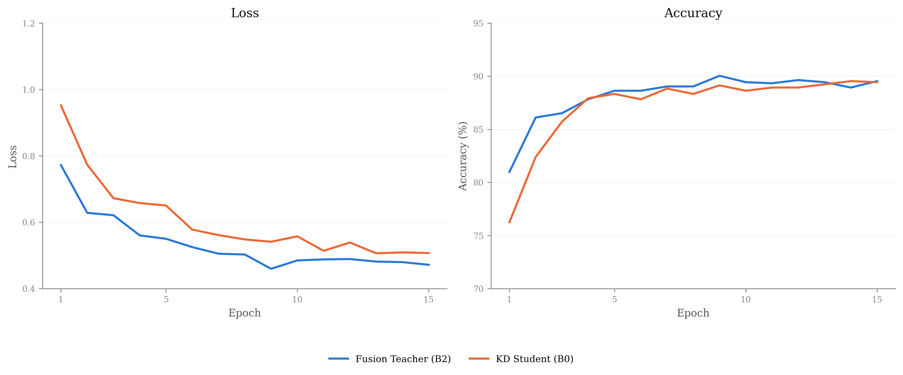

# Research_SkinDisease

Official training code for *Progressive Training Optimization and Knowledge Distillation for Efficient Multiclass Skin Disease Classification on Resource-Constrained Devices* (Khai-Thanh Le, Pham Trong Huynh; submitted to the *Journal of Medical and Biological Engineering*).

The study asks how much of a classification gain comes from training-time optimization versus architectural capacity, and whether it survives compression. An EfficientNet-B2 backbone is optimized with label smoothing, CutMix, Sharpness-Aware Minimization (SAM) and learning-rate tuning, extended with a **dual-level C4/C5 fusion head**, then used as a teacher for response-based **knowledge distillation** into a lightweight EfficientNet-B0 student. Every hyperparameter is selected on a held-out validation split before the configuration is frozen and retrained/evaluated on the untouched test split across three seeds — see [Evaluation Protocol](#evaluation-protocol).

On the **Skin31** dataset (31 disease categories, 4,910 images): training optimization raised EfficientNet-B2 test accuracy from 84.04% ± 0.52% to 89.64% ± 0.51%, the fusion head added only 0.20 points (89.84% ± 0.26%), and the distilled EfficientNet-B0 student reached 89.91% ± 0.57% with 68.08% fewer parameters and 75.11% fewer operations than its teacher — while beating a student distilled from a non-fusion teacher in all three seeds. The exported student ran in 31.23 ms on a mid-range mobile SoC at unchanged accuracy.

See `../output/JMBE-Khai/paper.tex` for the full manuscript and `../output/SI/ESM_1.tex` for the supplementary tables/figures referenced below.

## Highlights

- An evaluation protocol that separates hyperparameter selection (70/10/20 validation split) from final testing (80/20), with every configuration reported across three random seeds rather than as a single run.
- A component-wise analysis showing that most of the improvement over the reproduced EfficientNet-B2 baseline comes from training optimization, not from the dual-level fusion head's extra capacity.
- A two-teacher distillation ablation showing the fused representation's benefit is more apparent after distillation than in the teacher's own accuracy — it is a better supervisory signal than a deployment model.
- A computational assessment based on latency, throughput and peak memory measured directly on four platforms, including a mid-range mobile system-on-chip, not on parameter/operation counts alone.

## Evaluation Protocol

<a id="evaluation-protocol"></a>

The dataset ships with a fixed 80/20 train/test split (3,916 / 994 images) and no validation partition. Hyperparameter selection and final testing are deliberately separated into two phases so the 994-image test set never influences a modelling decision:

1. **`--data-mode dev` (70/10/20).** 490 images (12.5% of the 3,916 training images, ≈10% overall) are carved out by stratified sampling as a validation split. Every design decision — optimizer/scheduler, SAM radius, learning rate, label smoothing, CutMix, the fusion head — is selected on validation accuracy only, and the checkpoint with the best validation metric is kept.
2. **`--data-mode final` (80/20, the default).** Hyperparameters are frozen, the validation split is returned to training (back to the full 3,916 images), and every model is retrained from ImageNet-pretrained weights. There is **no checkpoint selection**: training runs for a fixed 15-epoch budget and the final-epoch weights are evaluated once on the untouched 994-image test set. Each configuration is repeated with seeds 42, 123 and 2024.

This is implemented in [`skin_disease/datasets.py`](skin_disease/datasets.py) (`build_skin31_dataloaders(..., data_mode=...)`) and [`skin_disease/experiment.py`](skin_disease/experiment.py) (`run_experiment(..., data_mode=...)`), and exposed as `--data-mode` on [`scripts/train.py`](scripts/train.py).

## Model Architecture


Given a `224×224` input, the EfficientNet-B2 backbone exposes two complementary feature maps instead of only its final output: the intermediate **C4** (stride 16) and the deep **C5** (stride 32). Both are projected to a shared channel width with a `1×1` conv + BN + SiLU, spatially aligned by upsampling C5 to the C4 resolution, concatenated, and fused with a `3×3` conv + BN + SiLU before global average pooling and the linear classifier. The optimized teacher then supervises an EfficientNet-B0 student through response-based distillation on the output logits (panel C above).

| Feature level | Stride | Backbone shape `[B,C,H,W]` | Projected shape (`D=512`) |
|---|---|---|---|
| C4 (intermediate) | 16 | `[B, 120, 14, 14]` | `[B, 512, 14, 14]` |
| C5 (deep)          | 32 | `[B, 352, 7, 7]`   | `[B, 512, 7, 7]` → bilinear-upsampled to `14×14` |
| Fused (`F_fus`)     | 16 | `Concat(Ĉ4, Ĉ5) → [B, 1024, 14, 14]` | `Conv3×3 → [B, 512, 14, 14]` |

Implementation: [`skin_disease/models/dual_level_fusion.py`](skin_disease/models/dual_level_fusion.py) — `DualLevelFusionHead` (the fusion module above) and `EfficientNetB2DualLevel` (backbone + fusion head + classifier). The unmodified backbone path is `EfficientNetB2Original` / `efficientnet_b2_original`, used for both the B2 baseline and the B0 student (`model_variant="original"` vs. `"dual_level"`).

## Hyperparameter Selection (validation subset)

All results in this section are validation accuracy under `--data-mode dev`, one run per configuration (Supplementary Tables S2–S3).

| Optimizer | Scheduler | Validation accuracy (%) |
|---|---|---:|
| Adam | None | 81.84 |
| AdamW | None | 82.45 |
| Adam | Cosine annealing | 84.08 |
| **AdamW** | **Cosine annealing** | **85.10** |

AdamW + cosine annealing was selected as the baseline optimizer for every subsequent experiment (`--optimizer adamw`, the CLI default).

The SAM neighbourhood radius ρ and the initial learning rate were then searched jointly (label smoothing + CutMix active in every cell):

| SAM radius ρ | LR 1×10⁻⁴ | LR 2.5×10⁻⁴ | LR 5×10⁻⁴ | LR 1×10⁻³ |
|---|---:|---:|---:|---:|
| 0.04 | 87.55 | 88.57 | 88.16 | 88.57 |
| 0.06 | 87.76 | 88.98 | 88.37 | 88.57 |
| 0.08 | 88.37 | 90.00 | 89.18 | 88.16 |
| 0.10 | 88.37 | **90.41** | 88.37 | 87.55 |

ρ = 0.10 with an initial learning rate of 2.5×10⁻⁴ was selected (`--sam-rho 0.10 --lr 2.5e-4`) and reused for every final-mode experiment below.

## Training Optimization

Three training-time techniques are applied **without changing the inference architecture**, evaluated individually and cumulatively on the validation subset (single run each; the 490-image validation set means one image ≈ 0.204 points, so read this table for its ordering rather than the exact size of small increments):

| Configuration | Label Smoothing | CutMix | SAM | Initial LR | Validation accuracy (%) |
|---|:---:|:---:|:---:|---|---:|
| Baseline | | | | 5×10⁻⁴ | 85.10 |
| Isolated effect | ✓ | | | 5×10⁻⁴ | 87.55 |
| Isolated effect | | ✓ | | 5×10⁻⁴ | 87.35 |
| Isolated effect | | | ✓ | 5×10⁻⁴ | 87.14 |
| Cumulative | ✓ | ✓ | | 5×10⁻⁴ | 86.94 |
| Cumulative | ✓ | ✓ | ✓ | 5×10⁻⁴ | 88.37 |
| **Training optimization** | ✓ | ✓ | ✓ | **2.5×10⁻⁴** | **90.41** |

Label smoothing (ε = 0.1) and CutMix (α = 1.0, mixing probability 1.0) did not combine additively at the baseline learning rate — consistent with under-fitting from softening targets and perturbing inputs simultaneously — but adding SAM and then reducing the learning rate recovered and then exceeded the individual gains. Of the 5.31-point total improvement, the majority is attributable to SAM combined with learning-rate tuning rather than to label smoothing and CutMix alone.

## Final Test-Set Results

Under `--data-mode final`, hyperparameters above are frozen and every configuration is retrained on the full 80/20 split and reported as mean ± SD over seeds 42, 123 and 2024 (Supplementary Table S5):

| Model | Accuracy (%) | Balanced acc. (%) | Macro prec. (%) | Macro F1 (%) |
|---|---:|---:|---:|---:|
| EfficientSkinDis (reported)ᵃ | 87.15 | — | 87.00 | 87.00 |
| EfficientNet-B2 baseline | 84.04 ± 0.52 | 85.28 ± 0.70 | 86.10 ± 0.70 | 85.45 ± 0.47 |
| + training optimization | 89.64 ± 0.51 | 91.05 ± 0.32 | 91.89 ± 0.70 | 91.14 ± 0.44 |
| + fusion (teacher) | 89.84 ± 0.26 | 90.96 ± 0.44 | 91.49 ± 0.37 | 90.85 ± 0.36 |
| EfficientNet-B0 baseline | 85.68 ± 0.48 | 87.03 ± 0.55 | 87.98 ± 0.56 | 87.31 ± 0.46 |
| + training optimization | 88.97 ± 0.91 | 90.58 ± 0.78 | 90.86 ± 0.89 | 90.47 ± 0.84 |
| + KD, non-fusion teacher (control) | 89.44 ± 0.27 | 90.85 ± 0.30 | 91.70 ± 0.41 | 90.88 ± 0.33 |
| **+ KD, fusion teacher (proposed)** | **89.91 ± 0.57** | **91.30 ± 0.17** | **91.94 ± 0.39** | **91.26 ± 0.20** |

ᵃ Single run reported by the original authors under a different data partition and training protocol; not directly comparable.



| Model | Params (M) | GMACs | Latency (ms, Tesla T4) | Throughput (FPS) | Peak mem. (MB) |
|---|---:|---:|---:|---:|---:|
| EfficientNet-B2 baseline | 7.74 | 0.6773 | 11.96 ± 0.50 | 83.64 | 50.12 |
| + training optimization | 7.74 | 0.6773 | 12.06 ± 0.99 | 82.95 | 50.12 |
| + fusion (teacher) | 12.68 | 1.5994 | 12.84 ± 0.55 | 77.89 | 109.54 |
| EfficientNet-B0 baseline | 4.05 | 0.3981 | 8.33 ± 0.83 | 120.02 | 35.99 |
| + training optimization | 4.05 | 0.3981 | 8.27 ± 0.37 | 120.94 | 35.99 |
| + KD, non-fusion teacher | 4.05 | 0.3981 | 8.37 ± 0.36 | 119.49 | 35.99 |
| **+ KD, fusion teacher (proposed)** | 4.05 | 0.3981 | 8.38 ± 0.43 | 119.35 | 35.99 |

The fourfold reduction in operations (teacher → student) translates into only a ~1.5× latency speed-up: depthwise separable convolutions are memory-bandwidth-bound, so MACs alone overstate the practical benefit.

## Knowledge Distillation

The frozen teacher supervises an EfficientNet-B0 student via temperature-scaled KL divergence on the output logits (`T = 4.0`), combined with the supervised CutMix-aware cross-entropy loss at `λ_KD = 0.7`:

```
L = (1 - λ_KD) * L_sup + λ_KD * L_KD,   λ_KD = 0.7,  T = 4.0
```

Response-based (logit) distillation was chosen deliberately: the teacher's concatenated C4/C5 fusion representation has no direct counterpart in the single-branch student, so a feature-level objective would need an extra learned projection whose contribution could not be separated from the fusion head's. To isolate that contribution, the whole procedure is repeated with a **second, non-fusion teacher** (EfficientNet-B2 with training optimization but without the fusion head) as a control arm — everything else identical, so the two students differ only in which teacher supervised them (`--kd-teacher-variant original` vs. `dual_level` in [Reproducing the Paper's Stages](#reproducing-the-papers-stages)).

| Model | Seed 42 | Seed 123 | Seed 2024 | Mean ± SD |
|---|---:|---:|---:|---:|
| EfficientNet-B2 fusion (teacher) | 90.04 | 89.54 | 89.94 | 89.84 ± 0.26 |
| KD student, non-fusion teacher | 89.13 | 89.64 | 89.54 | 89.44 ± 0.27 |
| **KD student, fusion teacher (proposed)** | **89.44** | **90.54** | **89.74** | **89.91 ± 0.57** |

The student distilled from the fusion teacher won in all three seeds (mean paired difference 0.47 points), a larger and more consistent margin than the 0.20-point gap between the two teachers themselves — evidence that the fusion head's value shows up in the student it produces rather than in its own accuracy.

Implementation: [`skin_disease/distillation.py`](skin_disease/distillation.py) (`kd_kl_loss`), wired into [`skin_disease/engine.py`](skin_disease/engine.py) (`forward_loss`) and [`skin_disease/experiment.py`](skin_disease/experiment.py) (`run_experiment` builds and freezes the `kd_teacher_variant` teacher checkpoint when `use_kd=True`).

## Error Analysis

 

*Left: row-normalized confusion matrix of the KD student (fusion teacher, seed 42). Right: Grad-CAM across the baseline, fusion teacher and distilled student for the four hardest categories.*

Residual errors concentrate in a few visually overlapping, mostly dermoscopic (ISIC-sourced) categories, and are strongly directional rather than symmetric — 30.67% of Nevus images were assigned to Actinic Keratosis against 11.54% in reverse:

| Class | Precision | Recall | F1-score | Support |
|---|---:|---:|---:|---:|
| Actinic Keratosis | 0.3922 | 0.7692 | 0.5195 | 26 |
| Nevus | 0.8571 | 0.6400 | 0.7328 | 75 |
| Squamous Cell Carcinoma | 0.8485 | 0.7000 | 0.7671 | 40 |
| Pigmented Benign Keratosis | 0.8511 | 0.8333 | 0.8421 | 96 |



*Per-epoch test loss/accuracy for the fusion teacher and distilled student (seed 42), reported for transparency only — final-epoch weights were used throughout and this curve played no part in checkpoint selection.*

On-device latency was measured separately for the exported (LiteRT/TFLite) student, which reproduced all 994/994 PyTorch test predictions exactly:

| Device | Class | Threads | Latency (ms) | Throughput (FPS) |
|---|---|---:|---:|---:|
| NVIDIA Tesla T4 | Server GPU | 1 | 8.38 ± 0.43 | 119.3 |
| Intel Core i5-4460 | Desktop CPU | 4 | 12.07 ± 0.78 | 82.8 |
| Snapdragon 8s Gen 4 | Flagship mobile | 2 | 14.06 ± 0.36 | 71.1 |
| Dimensity 7050 | Mid-range mobile | 2 | 31.23 ± 0.91 | 32.0 |

The export/on-device benchmarking tooling itself is not part of this repository (see the manuscript, Section 2.4/3.5, for the measurement protocol).

## Repository Structure

```
skin_disease/            training package
  config.py                default hyperparameters and paths
  seed.py                   deterministic seeding / device selection
  transforms.py              fixed augmentations (zoom, rotate, brightness, shear, flips)
  datasets.py                 Skin31 ImageFolder loading + dev(70/10/20)/final(80/20) dataloaders
  metrics.py                   accuracy/balanced-accuracy/macro-F1/precision/recall
  cutmix.py                    CutMix augmentation
  sam.py                        Sharpness-Aware Minimization optimizer
  distillation.py                KD temperature-scaled KL loss
  engine.py                       forward/train/eval loops (CutMix + SAM + KD aware)
  experiment.py                    model/optimizer/scheduler builders + run_experiment()
  models/
    dual_level_fusion.py            EfficientNetB2Original and EfficientNetB2DualLevel
scripts/
  train.py                 CLI entry point (--data-mode dev|final)
  download_dataset.py       standalone dataset download (kagglehub -> data/)
assets/                   figures used in this README (copied from ../output/)
data/                     downloaded dataset (git-ignored, created on first run)
outputs/                  checkpoints, per-epoch history, experiment_summary.csv (git-ignored)
notebooks/                personal experiment notebooks (git-ignored, not part of the official code)
```

`model_variant="original"` is the plain EfficientNet classifier (used for both the B2 baseline and the B0 student). `model_variant="dual_level"` is the EfficientNet-B2 backbone with the dual-level C4/C5 fusion head (teacher only).

## Install

```
pip install -r requirements.txt
```

## Dataset

`--dataset-root` must contain `train/` and `test/` subfolders in `torchvision.datasets.ImageFolder` layout (one subfolder per disease class), matching the 80/20 Skin31 split (24 clinical categories from the Dermatology Atlas, 7 dermoscopic categories from the ISIC archive; 4,910 images, 31 categories).

If `--dataset-root` is omitted, `scripts/train.py` downloads it automatically via [kagglehub](https://github.com/Kaggle/kagglehub) straight into `data/` inside the repo (requires a Kaggle account/API token — see kagglehub's docs for `kaggle.json` setup). `data/` is git-ignored, so the dataset is never pushed to the repo, and the download only happens once: subsequent runs reuse the local copy. To download it standalone instead:

```
python scripts/download_dataset.py
```

## Reproducing the Paper's Stages

<a id="reproducing-the-papers-stages"></a>

Each command is written on a single line so it can be pasted as-is into bash, cmd, or PowerShell (line-continuation characters differ across shells: `\` in bash, `` ` `` in PowerShell — mixing them breaks the other shell).

### Step 0 — hyperparameter search (`--data-mode dev`, optional)

Only needed to reproduce the validation-subset search itself; the frozen values are already baked into the defaults/commands below.

```bash
# Optimizer/scheduler comparison (Supplementary Table S2)
python scripts/train.py --exp-name "OPT search AdamW+cosine" --data-mode dev --model-name efficientnet_b2 --model-variant original --optimizer adamw --scheduler cosine

# One cell of the SAM radius x LR grid (Supplementary Table S3)
python scripts/train.py --exp-name "SAM grid rho0.10 lr2.5e-4" --data-mode dev --model-name efficientnet_b2 --model-variant original --label-smoothing 0.1 --use-cutmix --cutmix-alpha 1.0 --use-sam --sam-rho 0.10 --lr 2.5e-4
```

### Step 1 — final training (`--data-mode final`, the default)

```bash
# Baseline (B2)
python scripts/train.py --exp-name "FINAL B2 Baseline" --model-name efficientnet_b2 --model-variant original --lr 5e-4

# + Training optimization (B2)
python scripts/train.py --exp-name "FINAL B2 Training Optimization" --model-name efficientnet_b2 --model-variant original --label-smoothing 0.1 --use-cutmix --cutmix-alpha 1.0 --use-sam --sam-rho 0.10 --lr 2.5e-4

# + Dual-level fusion (teacher)
python scripts/train.py --exp-name "FINAL B2 Fusion Teacher" --model-name efficientnet_b2 --model-variant dual_level --fusion-channels 512 --label-smoothing 0.1 --use-cutmix --cutmix-alpha 1.0 --use-sam --sam-rho 0.10 --lr 2.5e-4

# Baseline (B0)
python scripts/train.py --exp-name "FINAL B0 Baseline" --model-name efficientnet_b0 --model-variant original --lr 5e-4

# + Training optimization (B0)
python scripts/train.py --exp-name "FINAL B0 Training Optimization" --model-name efficientnet_b0 --model-variant original --label-smoothing 0.1 --use-cutmix --cutmix-alpha 1.0 --use-sam --sam-rho 0.10 --lr 2.5e-4

# + KD, non-fusion teacher (control arm) - repeat with --seed 42/123/2024
python scripts/train.py --exp-name "FINAL B0 KD non-fusion seed42" --seed 42 --model-name efficientnet_b0 --model-variant original --label-smoothing 0.1 --use-cutmix --cutmix-alpha 1.0 --use-sam --sam-rho 0.10 --lr 2.5e-4 --use-kd --kd-teacher-checkpoint /path/to/final_b2_training_optimization_final.pth --kd-teacher-variant original --kd-alpha 0.7 --kd-temperature 4.0

# + KD, fusion teacher (proposed) - repeat with --seed 42/123/2024
python scripts/train.py --exp-name "FINAL B0 KD fusion seed42" --seed 42 --model-name efficientnet_b0 --model-variant original --label-smoothing 0.1 --use-cutmix --cutmix-alpha 1.0 --use-sam --sam-rho 0.10 --lr 2.5e-4 --use-kd --kd-teacher-checkpoint /path/to/final_b2_fusion_teacher_final.pth --kd-teacher-variant dual_level --kd-teacher-fusion-channels 512 --kd-alpha 0.7 --kd-temperature 4.0
```

<details>
<summary>PowerShell (multi-line with backtick continuation)</summary>

```powershell
python scripts/train.py --exp-name "FINAL B2 Training Optimization" `
  --model-name efficientnet_b2 --model-variant original `
  --label-smoothing 0.1 --use-cutmix --cutmix-alpha 1.0 `
  --use-sam --sam-rho 0.10 --lr 2.5e-4
```

</details>

Each run writes its checkpoint and per-epoch history to `--work-dir` (default `outputs/`, git-ignored), and appends its final result row to `experiment_summary.csv` in that directory (`skin_disease.experiment.append_summary_result`) — running the three KD seeds in sequence accumulates a table like Knowledge Distillation above.

## Citation

If you use this code, please cite:

> Khai-Thanh Le, Pham Trong Huynh. *Progressive Training Optimization and Knowledge Distillation for Efficient Multiclass Skin Disease Classification on Resource-Constrained Devices.* Submitted to the Journal of Medical and Biological Engineering.
