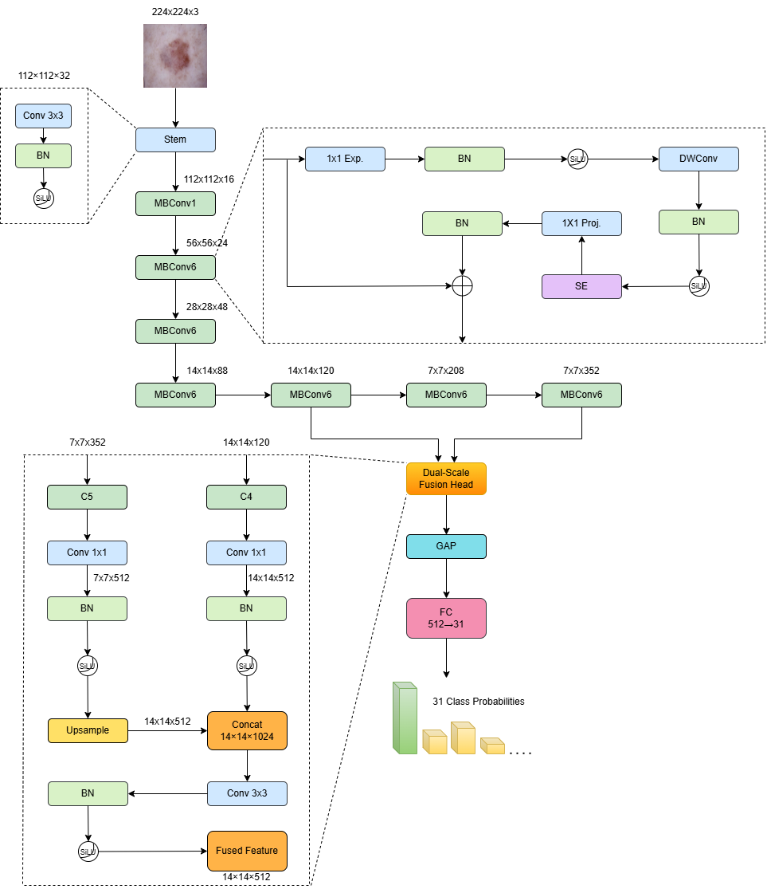
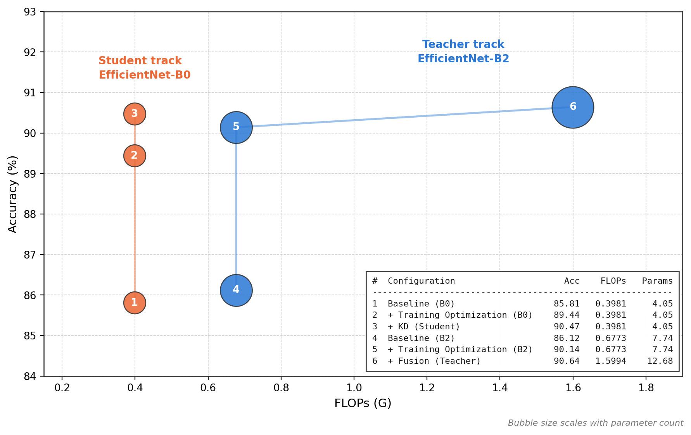
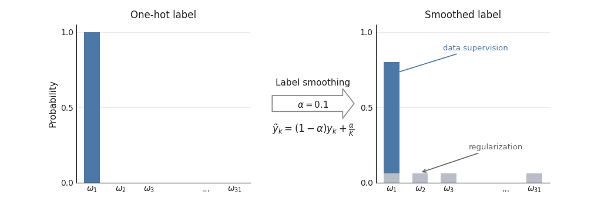
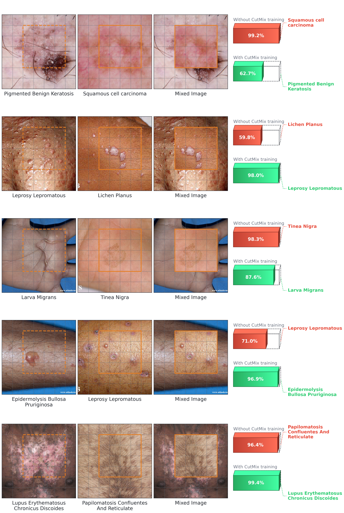
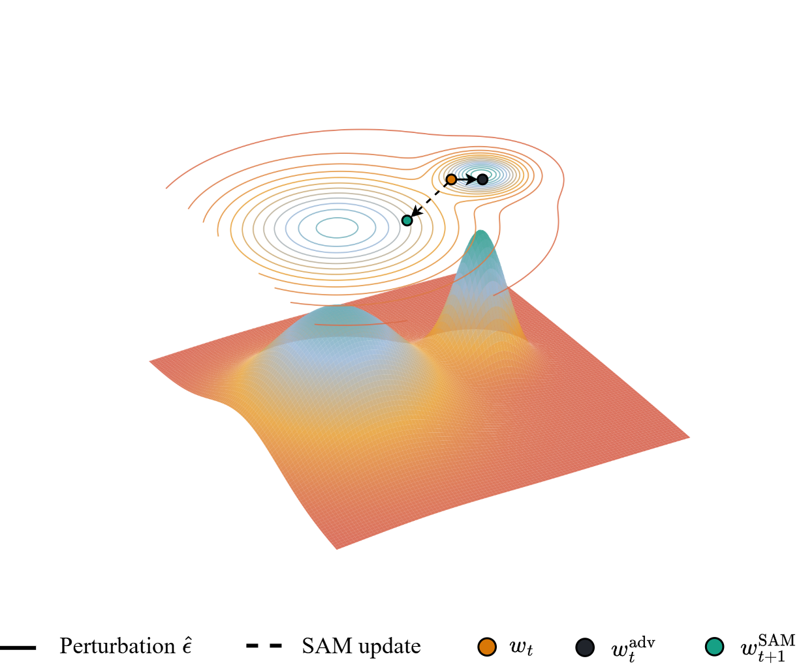
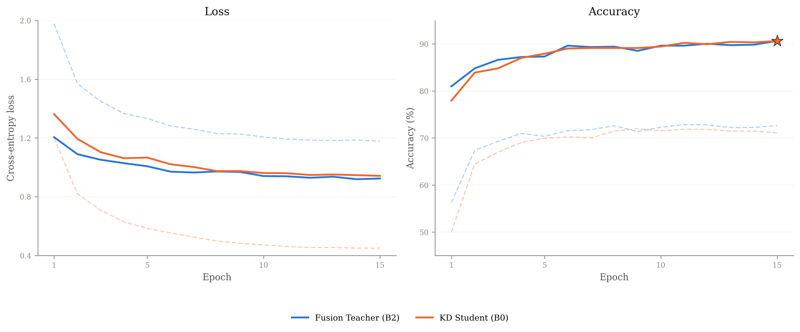
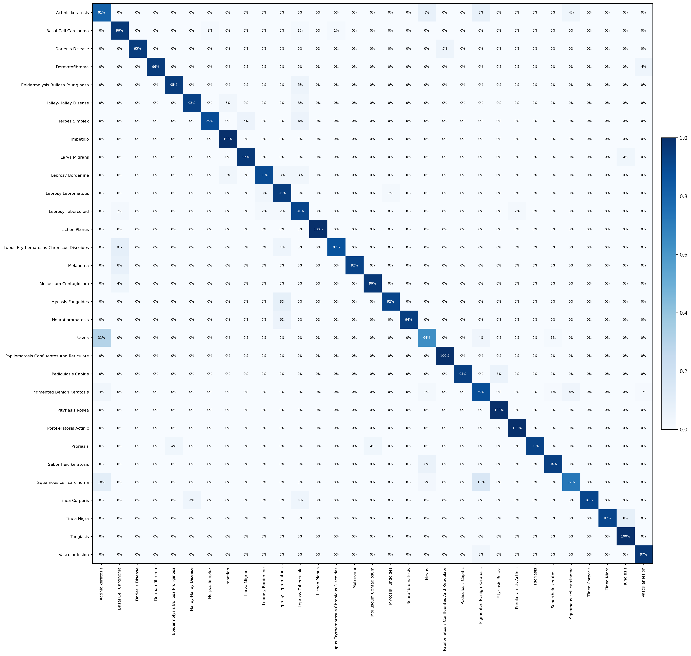
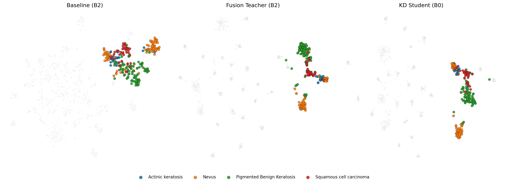

# EffSkinNet — Research_SkinDisease

Official training code for **EffSkinNet**, an efficient EfficientNet-based framework for multiclass skin disease classification. The framework progressively strengthens an EfficientNet-B2 baseline with training-time regularization, adds a **dual-level C4/C5 feature fusion head**, and finally distills the resulting teacher into a lightweight EfficientNet-B0 student via response-based knowledge distillation.

Evaluated on the **Skin31** dataset (31 disease categories, 4,910 images), the fusion teacher reaches **90.64%** accuracy (12.68M params, 1.60 GMACs) and the distilled student reaches **90.47% ± 0.21%** across 3 seeds with only **4.05M params, 0.40 GMACs** — a 68% parameter reduction and 75% compute reduction for a 0.17-point accuracy gap.

See `../paper.tex` for the full write-up (method, related work, ablations, qualitative analysis).

## Highlights

- Controlled component analysis of label smoothing, CutMix, SAM, and learning-rate tuning on an EfficientNet-B2 baseline.
- A lightweight **dual-level fusion head** combining stride-16 (C4) intermediate features with stride-32 (C5) deep semantic features from a single EfficientNet-B2 backbone.
- Response-based **knowledge distillation** from the fusion teacher into a structurally simpler EfficientNet-B0 student, requiring no architecturally matched intermediate features.
- Reported over overall/class-wise metrics, parameter and compute cost, and repeated-seed robustness for the distilled student.

## Model Architecture



Given a `224×224` input, the EfficientNet-B2 backbone exposes two complementary feature maps instead of only its final output: the intermediate **C4** (stride 16) and the deep **C5** (stride 32). Both are projected to a shared channel width with a `1×1` conv + BN + SiLU, spatially aligned by upsampling C5 to the C4 resolution, concatenated, and fused with a `3×3` conv + BN + SiLU before global average pooling and the linear classifier.

| Feature level | Stride | Backbone shape `[B,C,H,W]` | Projected shape (`D=512`) |
|---|---|---|---|
| C4 (intermediate) | 16 | `[B, 120, 14, 14]` | `[B, 512, 14, 14]` |
| C5 (deep)          | 32 | `[B, 352, 7, 7]`   | `[B, 512, 7, 7]` → bilinear-upsampled to `14×14` |
| Fused (`F_fus`)     | 16 | `Concat(Ĉ4, Ĉ5) → [B, 1024, 14, 14]` | `Conv3×3 → [B, 512, 14, 14]` |

Implementation: [`skin_disease/models/dual_level_fusion.py`](skin_disease/models/dual_level_fusion.py) — `DualLevelFusionHead` (the fusion module above) and `EfficientNetB2DualLevel` (backbone + fusion head + classifier). The unmodified backbone path is `EfficientNetB2Original` / `efficientnet_b2_original`, used for both the B2 baseline and the B0 student (`model_variant="original"` vs. `"dual_level"`, see [Reproducing the paper's stages](#reproducing-the-papers-stages)).

## Accuracy vs. Computational Cost



| Model | Acc. (%) | Params (M) | MACs (G) | Prec. (%) | Rec. (%) | F1 (%) |
|---|---:|---:|---:|---:|---:|---:|
| EfficientSkinDis (reported) | 87.15 | N.R. | N.R. | 87.00 | 87.00 | 87.00 |
| Baseline (B2) | 86.12 | 7.74 | 0.6773 | 88.47 | 87.45 | 87.72 |
| + Training Optimization | 90.14 | 7.74 | 0.6773 | 92.22 | 91.79 | 91.68 |
| **+ Fusion (Teacher)** | **90.64** | 12.68 | 1.5994 | 92.40 | 91.90 | 91.86 |
| Baseline (B0) | 85.81 | 4.05 | 0.3981 | 88.63 | 87.26 | 87.77 |
| + Training Optimization | 89.44 | 4.05 | 0.3981 | 91.71 | 90.70 | 90.93 |
| **+ KD (Student)** | 90.47 ± 0.21 | **4.05** | **0.3981** | **93.02** | **92.39** | **92.35** |

*Macro-averaged Prec./Rec./F1; MACs = multiply–accumulate operations; N.R. = not reported in the original paper.*

## Training Optimization

Three training-time techniques are applied **without changing the inference architecture**, each regularizing a different part of the learning process, then combined progressively on top of the EfficientNet-B2 baseline:

| Technique | Regularizes | Key hyperparameter | Isolated accuracy (vs. 86.12% baseline) |
|---|---|---|---:|
| Label Smoothing | target distribution | smoothing `ε = 0.1` | 87.02% (+0.91) |
| CutMix | effective training data | `α_cm = 1.0`, mix prob. 1.0 | 88.73% (+2.62) |
| SAM | optimization landscape | radius `ρ = 0.10`, lr `2.5e-4` | 88.33% (+2.21) |

| <br>Label smoothing | <br>CutMix | <br>SAM |
|:---:|:---:|:---:|

Combined cumulatively, then topped with the dual-level fusion head:

| Configuration | Label Smoothing | CutMix | SAM | Fusion | Accuracy (%) |
|---|:---:|:---:|:---:|:---:|---:|
| Baseline | | | | | 86.12 |
| Cumulative | ✓ | ✓ | | | 88.93 |
| Cumulative | ✓ | ✓ | ✓ | | 90.14 |
| Cumulative | ✓ | ✓ | ✓ | ✓ | 90.64 |

## Knowledge Distillation

The frozen fusion teacher (EfficientNet-B2 + dual-level fusion, trained with label smoothing + CutMix + SAM) supervises an EfficientNet-B0 student via temperature-scaled KL divergence on the output logits (`T = 4.0`), combined with the supervised CutMix-aware cross-entropy loss at `λ_KD = 0.7`:

```
L = (1 - λ_KD) * L_sup + λ_KD * L_KD,   λ_KD = 0.7,  T = 4.0
```

| Seed | Teacher | Student | Accuracy (%) |
|---|---|---|---:|
| 42 | Fusion EfficientNet-B2 | EfficientNet-B0 | 90.24 |
| 123 | Fusion EfficientNet-B2 | EfficientNet-B0 | 90.54 |
| 2024 | Fusion EfficientNet-B2 | EfficientNet-B0 | 90.64 |
| **Mean ± SD** | — | EfficientNet-B0 | **90.47 ± 0.21** |

Implementation: [`skin_disease/distillation.py`](skin_disease/distillation.py) (`kd_kl_loss`), wired into [`skin_disease/engine.py`](skin_disease/engine.py) (`forward_loss`) and [`skin_disease/experiment.py`](skin_disease/experiment.py) (`run_experiment` loads and freezes the teacher checkpoint when `use_kd=True`).

## Qualitative Results



*Per-epoch training/test loss and accuracy for the fusion teacher and KD student (seed 2024).*

 

*Left: row-normalized confusion matrix of the KD student. Right: t-SNE of the pooled penultimate-layer embedding for the four most-confused classes (baseline vs. fusion teacher vs. KD student).*

## Repository Structure

```
skin_disease/            training package
  config.py                default hyperparameters and paths
  seed.py                   deterministic seeding / device selection
  transforms.py              fixed augmentations (zoom, rotate, brightness, shear, flips)
  datasets.py                 Skin31 ImageFolder loading + class-balanced dataloaders
  cutmix.py                    CutMix augmentation
  sam.py                        Sharpness-Aware Minimization optimizer
  distillation.py                KD temperature-scaled KL loss
  engine.py                       forward/train/eval loops (CutMix + SAM + KD aware)
  experiment.py                    model/optimizer/scheduler builders + run_experiment()
  models/
    dual_level_fusion.py            EfficientNetB2Original and EfficientNetB2DualLevel
scripts/
  train.py                 CLI entry point
  download_dataset.py       standalone dataset download (kagglehub -> data/)
notebooks/
  skin-disease-1.ipynb     original experiment notebook (exploratory reference)
assets/                   figures used in this README (from ../image/Diagram)
data/                     downloaded dataset (git-ignored, created on first run)
outputs/                  checkpoints, per-epoch history, experiment_summary.csv (git-ignored)
```

`model_variant="original"` is the plain EfficientNet classifier (used for both the B2 baseline and the B0 student). `model_variant="dual_level"` is the EfficientNet-B2 backbone with the dual-level C4/C5 fusion head (teacher only).

## Install

```
pip install -r requirements.txt
```

## Dataset

`--dataset-root` must contain `train/` and `test/` subfolders in `torchvision.datasets.ImageFolder` layout (one subfolder per disease class), matching the 80/20 Skin31 split.

If `--dataset-root` is omitted, `scripts/train.py` downloads it automatically via [kagglehub](https://github.com/Kaggle/kagglehub) straight into `data/` inside the repo (requires a Kaggle account/API token — see kagglehub's docs for `kaggle.json` setup). `data/` is git-ignored, so the dataset is never pushed to the repo, and the download only happens once: subsequent runs reuse the local copy. To download it standalone instead:

```
python scripts/download_dataset.py
```

## Reproducing the Paper's Stages

Each command is written on a single line so it can be pasted as-is into bash, cmd, or PowerShell (line-continuation characters differ across shells: `\` in bash, `` ` `` in PowerShell — mixing them breaks the other shell).

```bash
# Baseline (Adam + cosine)
python scripts/train.py --exp-name "Baseline B2" --model-name efficientnet_b2 --model-variant original

# + Training optimization (label smoothing + CutMix + SAM, lr=2.5e-4, rho=0.10)
python scripts/train.py --exp-name "B2 + LS + CutMix + SAM" --model-name efficientnet_b2 --model-variant original --label-smoothing 0.1 --use-cutmix --cutmix-alpha 1.0 --use-sam --sam-rho 0.10 --lr 2.5e-4

# + Dual-level fusion (teacher)
python scripts/train.py --exp-name "B2 Dual-Level Fusion Teacher" --model-name efficientnet_b2 --model-variant dual_level --fusion-channels 512 --label-smoothing 0.1 --use-cutmix --cutmix-alpha 1.0 --use-sam --sam-rho 0.10 --lr 2.5e-4

# Knowledge distillation into EfficientNet-B0 (repeat with --seed 42/123/2024)
python scripts/train.py --exp-name "B0 KD Student seed42" --seed 42 --model-name efficientnet_b0 --model-variant original --label-smoothing 0.1 --use-cutmix --cutmix-alpha 1.0 --use-sam --sam-rho 0.10 --lr 2.5e-4 --use-kd --kd-teacher-checkpoint /path/to/b2_dual_level_fusion_teacher_best.pth --kd-teacher-fusion-channels 512 --kd-alpha 0.7 --kd-temperature 4.0
```

<details>
<summary>PowerShell (multi-line with backtick continuation)</summary>

```powershell
python scripts/train.py --exp-name "B2 + LS + CutMix + SAM" `
  --model-name efficientnet_b2 --model-variant original `
  --label-smoothing 0.1 --use-cutmix --cutmix-alpha 1.0 `
  --use-sam --sam-rho 0.10 --lr 2.5e-4
```

</details>

Each run writes its best checkpoint and per-epoch history to `--work-dir` (default `outputs/`, also git-ignored), and appends its final result row to `experiment_summary.csv` in that directory.

## Citation

If you use this code, please cite:

> Thanh Khai Le, Dong-Nguyen Ngo, Pham Trong Huynh. *EffSkinNet: An Efficient Framework for Multiclass Skin Disease Classification.*
